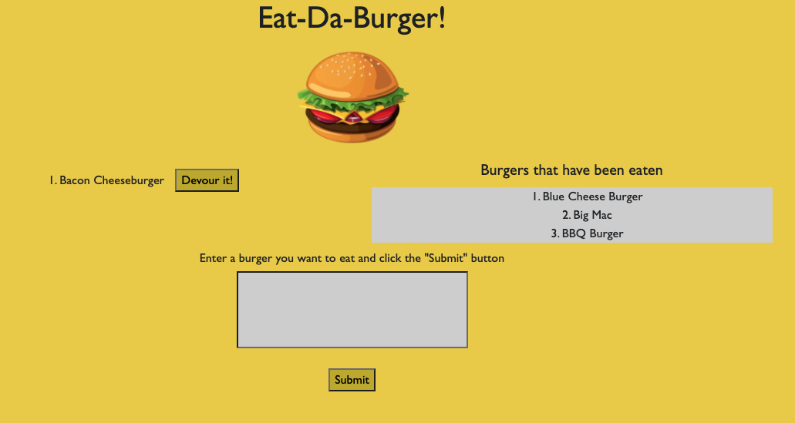

# Burger App

## Goals
- The Goal of this project was to create a page where you can add burgers, if they were eaten they will be moved to the "eaten" list.

## Process
Design Process: I was referencing a different exercise called the cat app within our class activities. Using this, I was able to use the general outline to help guide me through the coding process. 
Coding process: The process of this was to make several folders including the config, controllers, db, models, public, and views folders. Each folder has its own job within the code. The config file allows the app to connect to mysql (the database). The controllers folder is the code with the functions that allow the user to add to the table within the database. The models folder has condensed versions of these functions and will then execute them when called. The public folder has all of the public data such as the css and ajax calls. The views folder has the handlebar layouts. Finally, the server.js file creates paths so that each of the files can all connect to each other. 

## Technologies
- Express
- node.js
- mysql
- Express Handlebars

## Issues
- The main issue I came across while trying to deploy this app was deploying on heroku but I was ultimately able to figure it out using JAWSDB and Sequel Pro.

## Heroku Deployment
- https://rocky-sands-44438.herokuapp.com/
